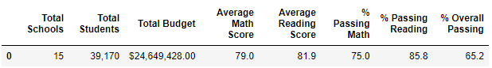
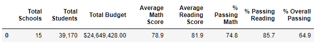
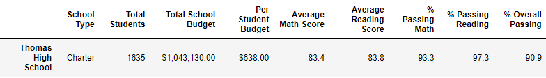
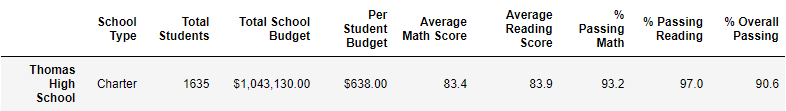
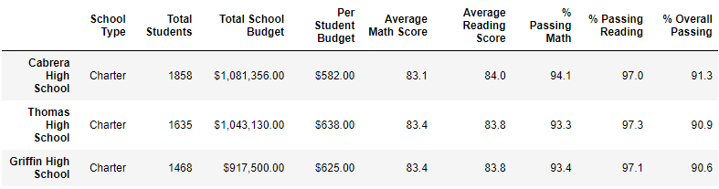
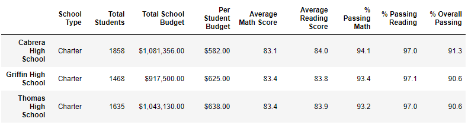
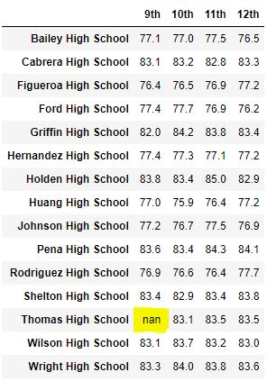

# School District Analysis

## Overview
Analysis was done on a District level Standardized Math and Reading test results. Results were submitted to the district office for review.

### Background
Reading and Math test results for a set of 15 schools were subject to the initial analysis. There were signs of academic dishonesty seen within the Thomas High School 9th grade math and reading scores. I am tasked with re analyzing the dataset by removing the Thomas High School 9th grade data.

### Objectives
To revise summary data for the school district's standardized math and reading test results.

### Deliverables
1. Provide a district level overview of the data.
2. Summarize the dataset by School.
3. Find and list the top five and bottom five schools by performance.
4. Summarize the math and reading scores per school by grade level.
5. Summarize the scores by spending levels.
6. Summarize the scores by school size.
7. Summarize the scores by school type.

## Methods

### Resources
Two data sources, software and a repository were used in the analysis efforts of the data.
- Data Sources: Two sources were provided containing school data and student data.
    - schools_complete.csv [school_level_data](Resources/schools_complete.csv)
    - student_complete.csv [student_data](Resources/students_complete.csv)
- Software:
    - Jupyter Notebook in combination with Python was used to create, compile and run the code in the analysis of the data.
    - Visual Studios Code was used to display the instructions and collect notations.
    - Microsoft Excel was used to open and inspect the CSV files.
-Repository: GitHub was used as the repository to store, update and share the code with the project group.

### Procedure
1. Clean the dataset
    - Load the student_complete.csv file into a Pandas DataFrame, student_data_df.
    - Strip the name prefixes and suffixes from the student names.
    - Replace the Thomas High School 9th grade math and reading scores with NaN by using the **df.loc** method.
2. Create a district level summary
    - Load the school_complete.csv into a new DataFrame, school_data_df.
    - Merge the school_data_df DataFrame into the student_data_df to form a single data frame containing both school and student data.
    - Calculate the number of schools and the total number of students.
    - Calculate the total budget.
    - Calculate the average math and reading scores.
    - Calculate the student count excluding the Thomas High School 9th graders.
    - Calculate the passing math and reading counts.
    - Calculate the passing percentages.
3. Create a school level summary
    - Determine school type for each school.
    - Calculate the student population per school.
    - Calculate average test scores for math and reading for each school.
    - Calculate the passing math and reading student counts.
    - Calculate the percentage of students passing math, reading and both.
4. Determine the high performing and low performing schools
    - Sort the per school dataset by the overall percentage ascending to find the bottom five and descending to find the top five.
5. Extract the math and reading scores by grade level.
    - Create data series for math and reading by grade level.
    - Group each school series by school name and find the average math and reading scores per school by each grade level.
6. Summarize the scores by spending levels.
    - Create the spending level bins and category names.
    - Calculate the summary values by grouping the data by the spending levels.
7. Summarize the scores by school size.
    - Create the school size bins and category labels.
    - Calculate the summary values for school size.
8. Summarize the scores by school type, Charter vs. District.
    - Calculate the summary data for the two categories.

## Results
Results were tabulated and compared between the original and refactored Thomas High School 9th grade test results.

### District Summary
The district summary data shifted slightly lower except for the **Average Reading Score**, which remained unchanged.

Original District Summary:

Refactored District Summary:

### School Summary
The Per School Summary Data for Thomas High School were slightly different after the refactoring, the change was not significant. The results are shown in the figure below.

Original School Summary Results:

Refactored School Summary Results:

### High and Low Performing Schools
The performance for the schools were ranked according to the **% Overall Passing** score. When original and refactored data were compared it was noted that the Thomas High School overall performance dropped from **90.9%** to **90.6%**. This slight change in the overall performance dropped the ranking for Thomas High School form 2nd to 3rd.  The bottom rankings remained static.

Original Top School Rankings:

Refactored Top School Rankings:

### Scores By Grade Level
There is no effect seen in the grade level school performance in the refactored dataset. The replacing of the Thomas High School 9th grade math and reading scores change the display of the 9th grade score of the said school to **nan**.  The other summary data is not affected.  An example is displayed in the figure below.

Refactored Math Scores:

### Scores By Spending Levels
Refactoring the data to exclude Thomas High School 9th grade test scores had no visible effects on the Scores by Spending levels.

### Scores By School Size
The scores by school size was also not affected by the refactoring of the data.

### Scores By School Type
Scores by school Type also showed no change in the refactored summary data.

## Summary
In summary, there is very little change seen by refactoring the data by removing Thomas High School 9th grade test results from the dataset.

## Conclusion
The summary data for the district test scores are resilient and has very little effect on the refactored dataset. This suggests one of two reasons.
1. The student population of Thomas High School 9th grade is not significant in comparison to the total student body within the school district.
2. There was not academic dishonesty within the Thomas High School 9th grade students.

It is my recommendation that the data be studied in more detail to see if infact there was foul play during the administration or the recording of scores for these tests.
